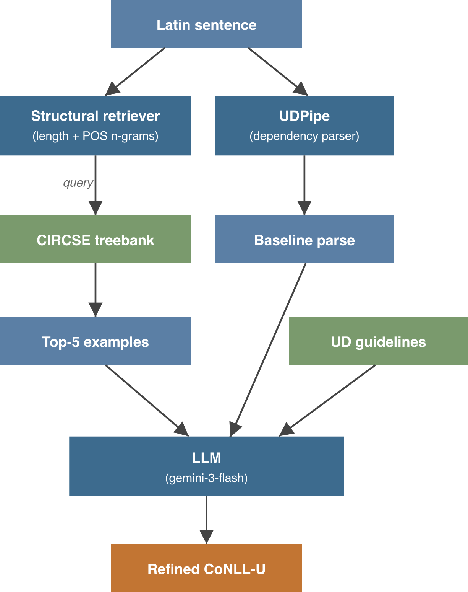

# THIVLVC: Retrieval Augmented Dependency Parsing for Latin

Code and data for our [EvaLatin 2026](https://circse.github.io/LT4HALA/2026/EvaLatin) paper.

> "```THIVLVC```: Retrieval Augmented Dependency Parsing for Latin"
> Luc Pommeret, Thibault Wagret, Jules Deret
> *LT4HALA 2026 Workshop @ LREC 2026*

## Overview

THIVLVC is a two-stage system for Latin dependency parsing:

1. **Retrieval**: Given an input sentence, retrieve structurally similar examples from the CIRCSE treebank using sentence length and POS n-gram similarity.
2. **Generation**: An LLM refines the UDPipe baseline parse using the retrieved examples and UD annotation guidelines.

We submit two configurations:
- **THIVLVC_1**: LLM + UDPipe + UD guidelines (no retrieval)
- **THIVLVC_2**: THIVLVC_1 + RAG on CIRCSE

<p align="center">
  
</p>

## Results

| System | Genre | CLAS (subtypes) | LAS (subtypes) |
|--------|-------|-----------------|-----------------|
| UDPipe | Poetry | 56.94 | 57.22 |
| UDPipe | Prose | 79.41 | 82.17 |
| THIVLVC_1 | Poetry | 72.71 | 70.36 |
| THIVLVC_1 | Prose | 74.04 | 75.72 |
| **THIVLVC_2** | **Poetry** | **74.03** | **72.88** |
| **THIVLVC_2** | **Prose** | **80.92** | **83.26** |

## Repository Structure

```
THIVLVC/
├── src/
│   ├── retrieval/          # Retrieval strategies (TF-IDF, structural, morphological)
│   ├── pipeline/           # Main RAG pipeline and baseline generation
│   ├── evaluation/         # Official CoNLL-18 evaluation script
│   └── utils/              # CoNLL-U parsing, LLM client, validation
├── scripts/                # Experiment runners and evaluation scripts
├── web_eval/               # Blind annotation interface for error analysis
├── data/                   # UD guidelines
└── requirements.txt
```

## Installation

```bash
pip install -r requirements.txt
```

Create a `.env` file with your preferred provider:
```bash
# OpenRouter (any model: Gemini, Claude, Llama, Qwen, etc.)
OPENROUTER_API_KEY=your_key_here
```

## Usage

### 1. Generate UDPipe baseline

```bash
python src/pipeline/generate_baseline.py \
  --input data/input.conllu \
  --output data/baseline.conllu \
  --model latin-circse-ud-2.17-251125
```

### 2. Run THIVLVC (RAG + LLM refinement)

Via **OpenRouter** (any model):
```bash
python src/pipeline/stage1_rag_with_baseline.py \
  --input_file data/input.conllu \
  --latinpipe_file data/baseline.conllu \
  --kb_file data/UD_Latin-CIRCSE/la_circse-ud-train.conllu \
  --guidelines_file data/LATIN_UD_GUIDELINES_CIRCSE.md \
  --output_file output/predictions.conllu \
  --provider openrouter \
  --model google/gemini-2.0-flash-001
```

Via **local model** (Ollama):
```bash
# Start Ollama with your model first: ollama run qwen3:72b
python src/pipeline/stage1_rag_with_baseline.py \
  --input_file data/input.conllu \
  --latinpipe_file data/baseline.conllu \
  --kb_file data/UD_Latin-CIRCSE/la_circse-ud-train.conllu \
  --guidelines_file data/LATIN_UD_GUIDELINES_CIRCSE.md \
  --output_file output/predictions.conllu \
  --provider local \
  --model qwen3:72b
```

Any OpenAI-compatible endpoint works with `--provider local --base_url <url>` (vLLM, text-generation-inference, etc.).

### 3. Evaluate retrieval strategies

```bash
python scripts/test_rag_strategies.py \
  --kb_file data/UD_Latin-CIRCSE/la_circse-ud-train.conllu \
  --test_file data/test.conllu
```

### 4. Evaluate predictions

```bash
python src/evaluation/conll18_ud_eval.py gold.conllu predictions.conllu
```

## Error Analysis

The `web_eval/` directory contains the blind annotation interface used for our error analysis (Section 5 of the paper). To run it locally:

```bash
cd web_eval && python -m http.server 8000
```

Then open `http://localhost:8000` in your browser.

## Citation

```bibtex
@inproceedings{pommeret-etal-2026-thivlvc,
    title = "{THIVLVC}: Retrieval Augmented Dependency Parsing for Latin",
    author = "Pommeret, Luc  and
      Wagret, Thibault and
      Deret, Jules",
    editor = "Sprugnoli, Rachele  and
      Passarotti, Marco",
    booktitle = "Proceedings of the Fourth Workshop on Language Technologies for Historical and Ancient Languages (LT4HALA 2026)",
    month = may,
    year = "2026",
    address = "Palma, Mallorca (Spain)",
    publisher = "ELRA"
}
```
